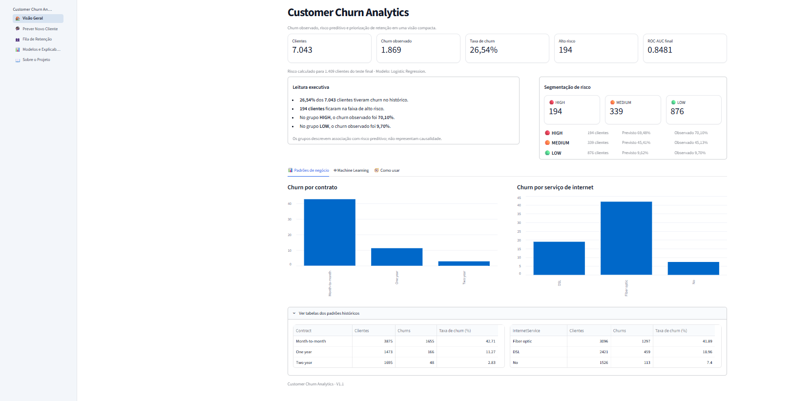
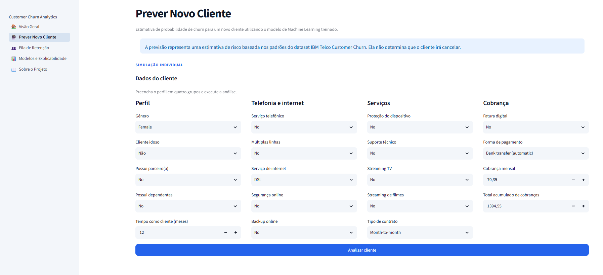
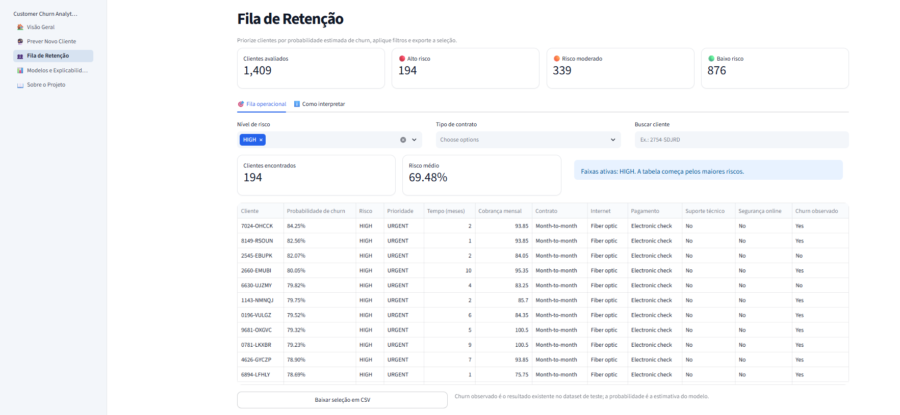
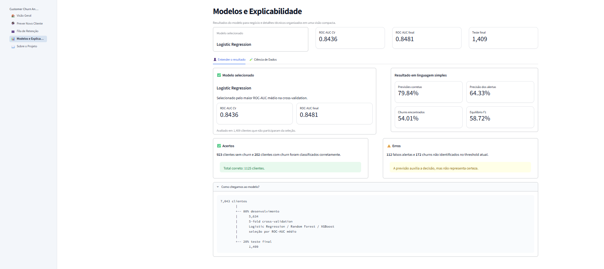
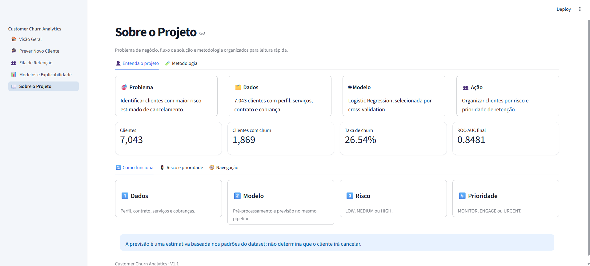
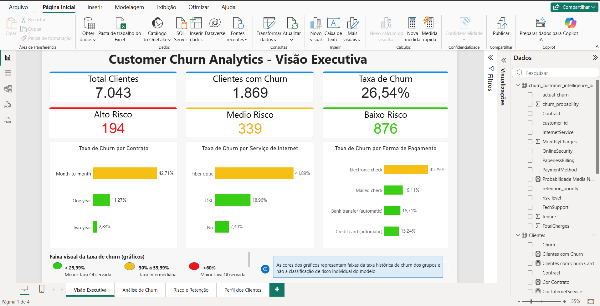
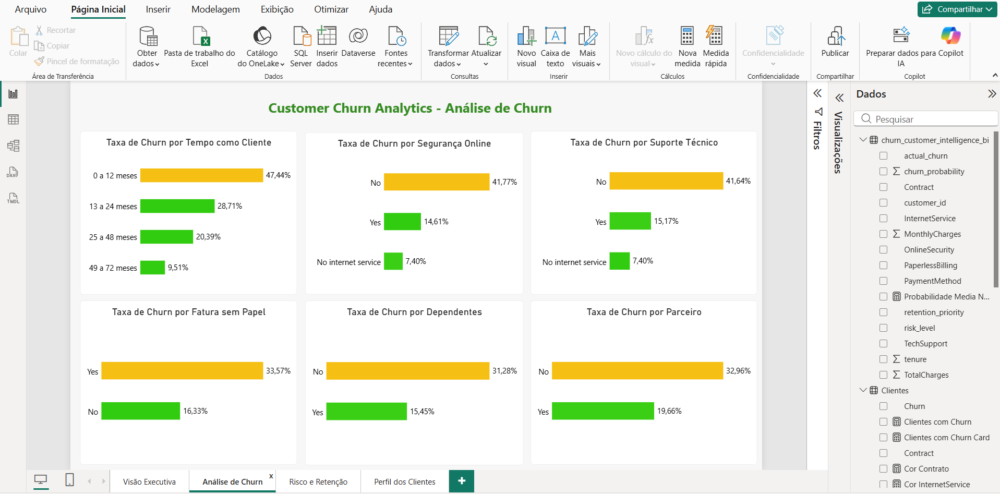
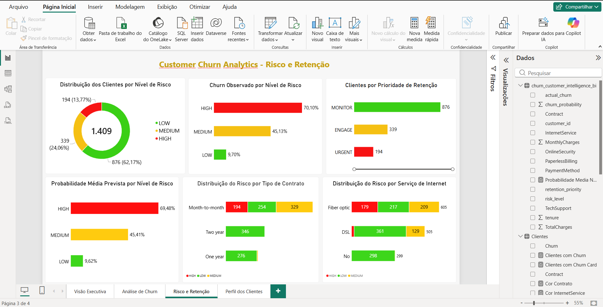
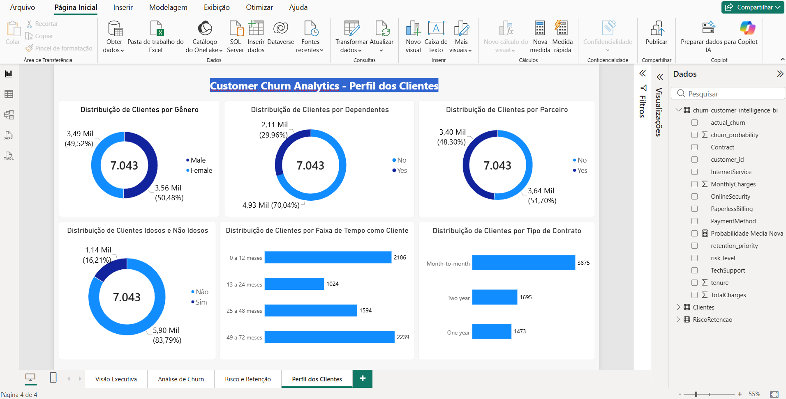
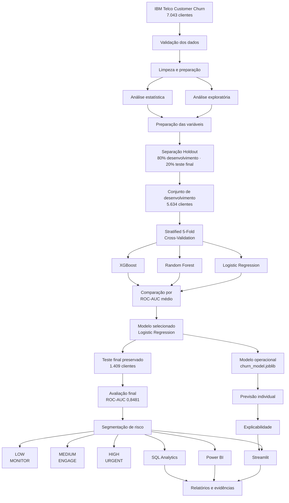

# Customer Churn Analytics & Prediction

> **Customer Analytics · Machine Learning · Retention Intelligence · Explainable AI · Streamlit · SQL · Power BI**

Solução end-to-end para **análise de churn, previsão de risco e priorização de retenção de clientes**, desenvolvida com Python, Machine Learning, explicabilidade, SQL, Streamlit e Power BI.

O projeto utiliza a base **IBM Telco Customer Churn** para investigar padrões históricos de cancelamento, comparar modelos preditivos, estimar o risco de churn e transformar probabilidades em informações úteis para ações de retenção.

> **Pergunta de negócio:** quais clientes apresentam maior risco estimado de cancelar o serviço e como organizar a priorização das ações de retenção?

**Aplicação 1.2.0** · **Modelo ML v1.1** · **Python 3.12.1** · **Streamlit** · **Power BI** · **Licença MIT**

---

<a id="indice"></a>

# Índice

1. [Visão rápida](#visao-rapida)
2. [Problema de negócio](#problema-de-negocio)
3. [Demonstração visual](#demonstracao-visual)
   - [Streamlit](#demonstracao-streamlit)
   - [Power BI](#demonstracao-powerbi)
4. [Arquitetura da solução](#arquitetura-da-solucao)
5. [Dados utilizados](#dados-utilizados)
6. [Análise exploratória](#analise-exploratoria)
7. [Análise estatística](#analise-estatistica)
8. [Preparação dos dados](#preparacao-dos-dados)
9. [Estratégia de validação](#estrategia-de-validacao)
10. [Modelos avaliados](#modelos-avaliados)
11. [Resultados dos modelos](#resultados-dos-modelos)
12. [Avaliação no teste final](#avaliacao-no-teste-final)
13. [Segmentação de risco](#segmentacao-de-risco)
14. [Prioridade de retenção](#prioridade-de-retencao)
15. [Previsão x comportamento observado](#previsao-x-observado)
16. [Previsão de novos clientes](#previsao-novos-clientes)
17. [Modelo operacional](#modelo-operacional)
18. [Explicabilidade](#explicabilidade)
19. [Aplicação Streamlit](#aplicacao-streamlit)
20. [Dashboard Power BI](#dashboard-powerbi)
21. [Perfil da base](#perfil-da-base)
22. [SQL Analytics](#sql-analytics)
23. [Tecnologias](#tecnologias)
24. [Estrutura do projeto](#estrutura-do-projeto)
25. [Como executar](#como-executar)
26. [Comandos principais](#comandos-principais)
27. [Validação](#validacao)
28. [Rastreabilidade](#rastreabilidade)
29. [Testes automatizados](#testes-automatizados)
30. [Entregas](#entregas)
31. [Limitações](#limitacoes)
32. [Uso responsável](#uso-responsavel)
33. [Próximas evoluções](#proximas-evolucoes)
34. [Origem e evolução](#origem-e-evolucao)
35. [Autor](#autor)
36. [Licença](#licenca)

---

<a id="visao-rapida"></a>

# Visão rápida

| Indicador | Resultado |
|---|---:|
| Clientes na base | **7.043** |
| Clientes com churn | **1.869** |
| Taxa histórica de churn | **26,54%** |
| Desenvolvimento | **5.634 clientes** |
| Teste final | **1.409 clientes** |
| Modelos comparados | **3** |
| Validação cruzada | **5 folds** |
| Modelo selecionado | **Logistic Regression** |
| ROC-AUC médio CV | **0,8436** |
| ROC-AUC final | **0,8481** |
| Testes automatizados | **152 PASS** |
| Qualidade de código | **Ruff PASS** |

### Fluxo resumido

```text
7.043 clientes
      │
      ├── 5.634
      │     ↓
      │ Desenvolvimento
      │     ↓
      │ Cross-Validation
      │     ↓
      │ Comparação de modelos
      │     ↓
      │ Seleção
      │
      └── 1.409
            ↓
        Teste final
            ↓
        Avaliação
```

O projeto não termina na geração de uma métrica de Machine Learning.

Ele conecta:

```text
Dados
  ↓
Análise
  ↓
Machine Learning
  ↓
Validação
  ↓
Explicabilidade
  ↓
Segmentação de risco
  ↓
Priorização de retenção
  ↓
Streamlit + Power BI
```

[↑ Voltar ao índice](#indice)

---

<a id="problema-de-negocio"></a>

# Problema de negócio

Uma operação de retenção não consegue abordar todos os clientes com a mesma prioridade.

Por isso, é necessário identificar quais clientes apresentam maior risco estimado de cancelamento e organizar uma fila de atendimento baseada em dados.

O projeto busca responder perguntas como:

- quais perfis apresentam maior ocorrência histórica de churn;
- quais clientes apresentam maior probabilidade estimada de cancelamento;
- quais clientes devem ser analisados primeiro;
- quais características contribuíram para determinada previsão;
- como transformar o resultado do modelo em informação compreensível;
- como apresentar os resultados para acompanhamento operacional e gerencial.

> O projeto não afirma que uma característica cause churn e não garante que um cliente classificado como alto risco irá cancelar.

[↑ Voltar ao índice](#indice)

---

<a id="demonstracao-visual"></a>

# Demonstração visual

O projeto possui duas principais interfaces de apresentação dos resultados:

- **Streamlit** para exploração, previsão individual e operação;
- **Power BI** para acompanhamento analítico e gerencial.

Todas as capturas utilizadas como evidência estão armazenadas em:

```text
docs/evidence/
```

---

<a id="demonstracao-streamlit"></a>

## Streamlit

### Visão Geral

A página principal apresenta KPIs, padrões históricos, segmentação de risco e informações do modelo.



---

### Prever Novo Cliente

Permite informar os dados de um cliente e realizar uma previsão individual.



---

### Fila de Retenção

Organiza clientes para análise operacional de retenção.



---

### Modelos e Explicabilidade

Apresenta resultados, validação, teste final e explicações do modelo.



---

### Sobre o Projeto

Apresenta problema, dados, modelo, ação e metodologia.



---

<a id="demonstracao-powerbi"></a>

## Power BI

### Visão Executiva



---

### Análise de Churn



---

### Risco e Retenção



---

### Perfil dos Clientes



---

## Evidências disponíveis

```text
Streamlit: 17 screenshots
Power BI:   4 screenshots
Total:     21 screenshots
```

Estrutura:

```text
docs/evidence/
├── streamlit/
│   ├── 01-visao-geral/
│   ├── 02-prever-novo-cliente/
│   ├── 03-fila-retencao/
│   ├── 04-modelos-explicabilidade/
│   └── 05-sobre-projeto/
│
└── powerbi/
    ├── 01-visao-executiva.png
    ├── 02-analise-churn.png
    ├── 03-risco-retencao.png
    └── 04-perfil-clientes.png
```

[↑ Voltar ao índice](#indice)

---

<a id="arquitetura-da-solucao"></a>

# Arquitetura da solução



### Interpretação da arquitetura

A arquitetura separa explicitamente:

1. exploração e preparação dos dados;
2. desenvolvimento dos modelos;
3. seleção por validação cruzada;
4. avaliação independente no teste final;
5. geração da inteligência de risco;
6. previsão operacional;
7. explicabilidade;
8. visualização no Streamlit e Power BI;
9. geração de relatórios e evidências.

Essa separação reduz o risco de utilizar o conjunto final de teste durante a escolha do algoritmo.

[↑ Voltar ao índice](#indice)

---

<a id="dados-utilizados"></a>

# Dados utilizados

A base utilizada é a **IBM Telco Customer Churn**, composta por:

```text
7.043 clientes
```

A variável alvo é:

```text
Churn
```

## Perfil

- gender;
- SeniorCitizen;
- Partner;
- Dependents.

## Relacionamento

- tenure;
- Contract.

## Serviços

- PhoneService;
- MultipleLines;
- InternetService;
- OnlineSecurity;
- OnlineBackup;
- DeviceProtection;
- TechSupport;
- StreamingTV;
- StreamingMovies.

## Cobrança

- PaperlessBilling;
- PaymentMethod;
- MonthlyCharges;
- TotalCharges.

---

## Variáveis numéricas

```text
SeniorCitizen
tenure
MonthlyCharges
TotalCharges
```

## Variáveis categóricas

```text
gender
Partner
Dependents
PhoneService
MultipleLines
InternetService
OnlineSecurity
OnlineBackup
DeviceProtection
TechSupport
StreamingTV
StreamingMovies
Contract
PaperlessBilling
PaymentMethod
```

[↑ Voltar ao índice](#indice)

---

<a id="analise-exploratoria"></a>

# Análise exploratória

A análise histórica mostrou diferenças relevantes entre alguns grupos de clientes.

## Churn por contrato

| Contrato | Taxa de churn |
|---|---:|
| **Month-to-month** | **42,71%** |
| One year | 11,27% |
| Two year | 2,83% |

Clientes com contrato mensal apresentaram a maior taxa histórica de churn entre os tipos de contrato analisados.

---

## Churn por serviço de internet

| Serviço | Taxa de churn |
|---|---:|
| **Fiber optic** | **41,89%** |
| DSL | 18,96% |
| No | 7,40% |

---

## Churn por forma de pagamento

| Forma de pagamento | Taxa de churn |
|---|---:|
| **Electronic check** | **45,29%** |
| Mailed check | 19,11% |
| Bank transfer (automatic) | 16,71% |
| Credit card (automatic) | 15,24% |

---

## Churn por tempo como cliente

| Tempo de relacionamento | Taxa de churn |
|---|---:|
| **0 a 12 meses** | **47,44%** |
| 13 a 24 meses | 28,71% |
| 25 a 48 meses | 20,39% |
| 49 a 72 meses | 9,51% |

Na base analisada, a taxa de churn diminui conforme aumenta o tempo de relacionamento.

---

## Outros padrões observados

| Característica | Taxa de churn |
|---|---:|
| Sem segurança online | **41,77%** |
| Com segurança online | 14,61% |
| Sem suporte técnico | **41,64%** |
| Com suporte técnico | 15,17% |
| Fatura sem papel | **33,57%** |
| Sem fatura sem papel | 16,33% |
| Sem dependentes | **31,28%** |
| Com dependentes | 15,45% |
| Sem parceiro | **32,96%** |
| Com parceiro | 19,66% |

> Esses resultados representam associações observadas na base e não demonstram causalidade.

[↑ Voltar ao índice](#indice)

---

<a id="analise-estatistica"></a>

# Análise estatística

O projeto utiliza testes estatísticos para complementar a análise exploratória.

Foram aplicados:

```text
Qui-quadrado
Cramér's V
Mann–Whitney U
Tamanho de efeito
```

Essa etapa ajuda a avaliar diferenças e associações identificadas durante a exploração dos dados.

Os testes estatísticos não são utilizados para afirmar causalidade.

[↑ Voltar ao índice](#indice)

---

<a id="preparacao-dos-dados"></a>

# Preparação dos dados

O pipeline utiliza tratamento separado para variáveis numéricas e categóricas.

## Variáveis numéricas

```text
StandardScaler
```

## Variáveis categóricas

```text
OneHotEncoder
```

O pré-processamento faz parte do pipeline do modelo.

Isso garante que as mesmas transformações aplicadas durante o treinamento também sejam utilizadas na previsão de novos clientes.

[↑ Voltar ao índice](#indice)

---

<a id="estrategia-de-validacao"></a>

# Estratégia de validação

A versão 1.1 separa explicitamente:

```text
Desenvolvimento
      +
Teste final
```

## Holdout

Primeiro, 20% da base é reservado para avaliação final.

```text
Base completa:       7.043 clientes
Desenvolvimento:     5.634 clientes
Teste final:         1.409 clientes
```

Configuração:

```python
test_size = 0.20
random_state = 20260920
```

O teste final não participa da escolha do algoritmo.

---

## Cross-validation

Dentro dos 5.634 clientes do conjunto de desenvolvimento é utilizado:

```text
StratifiedKFold
5 folds
shuffle = True
random_state = 42
```

A métrica utilizada para seleção é:

```text
mean_cv_roc_auc
```

Depois da seleção do algoritmo, o modelo escolhido é avaliado no teste final preservado.

[↑ Voltar ao índice](#indice)

---

<a id="modelos-avaliados"></a>

# Modelos avaliados

Foram comparados três algoritmos:

```text
Logistic Regression
Random Forest
XGBoost
```

Todos utilizaram:

- o mesmo conjunto de desenvolvimento;
- o mesmo protocolo de validação cruzada;
- a mesma métrica de seleção.

[↑ Voltar ao índice](#indice)

---

<a id="resultados-dos-modelos"></a>

# Resultados dos modelos

## Validação cruzada

| Modelo | Accuracy | Precision | Recall | F1 | ROC-AUC |
|---|---:|---:|---:|---:|---:|
| **Logistic Regression** | **0,8040** | **0,6587** | **0,5472** | **0,5968** | **0,8436** |
| XGBoost | 0,7987 | 0,6540 | 0,5151 | 0,5757 | 0,8398 |
| Random Forest | 0,7891 | 0,6280 | 0,5030 | 0,5583 | 0,8189 |

A **Logistic Regression apresentou o maior ROC-AUC médio na validação cruzada entre os três modelos avaliados**.

Resultado:

```text
ROC-AUC médio = 0,8436
Desvio padrão = 0,0066
```

Por esse critério, ela foi selecionada para avaliação no teste final.

[↑ Voltar ao índice](#indice)

---

<a id="avaliacao-no-teste-final"></a>

# Avaliação no teste final

A Logistic Regression foi avaliada nos:

```text
1.409 clientes
```

reservados para o teste final.

## Métricas

| Métrica | Resultado |
|---|---:|
| Accuracy | **0,7984** |
| Precision | **0,6433** |
| Recall | **0,5401** |
| F1 | **0,5872** |
| ROC-AUC | **0,8481** |

---

## Matriz de confusão

| Resultado | Clientes |
|---|---:|
| Verdadeiro negativo | **923** |
| Falso positivo | **112** |
| Falso negativo | **172** |
| Verdadeiro positivo | **202** |

O conjunto de teste final não participou da seleção do algoritmo.

[↑ Voltar ao índice](#indice)

---

<a id="segmentacao-de-risco"></a>

# Segmentação de risco

Os **1.409 clientes** do conjunto final foram organizados em três níveis.

| Risco | Clientes | Participação |
|---|---:|---:|
| LOW | **876** | **62,17%** |
| MEDIUM | **339** | **24,06%** |
| HIGH | **194** | **13,77%** |
| **Total** | **1.409** | **100%** |

## Limites utilizados

```text
Probabilidade < 30%
→ LOW

30% ≤ Probabilidade < 60%
→ MEDIUM

Probabilidade ≥ 60%
→ HIGH
```

Esses thresholds representam regras operacionais adotadas no projeto.

[↑ Voltar ao índice](#indice)

---

<a id="prioridade-de-retencao"></a>

# Prioridade de retenção

Cada faixa recebe uma prioridade operacional.

| Risco | Prioridade | Interpretação |
|---|---|---|
| LOW | **MONITOR** | acompanhamento normal |
| MEDIUM | **ENGAGE** | avaliar ações de relacionamento |
| HIGH | **URGENT** | analisar primeiro |

O objetivo é transformar uma probabilidade produzida pelo modelo em uma informação mais fácil de utilizar operacionalmente.

A classificação não significa que o cliente obrigatoriamente cancelará o serviço.

[↑ Voltar ao índice](#indice)

---

<a id="previsao-x-observado"></a>

# Previsão x comportamento observado

No conjunto de teste também foi comparada a probabilidade média prevista com a taxa de churn observada.

| Risco | Probabilidade média prevista | Churn observado |
|---|---:|---:|
| HIGH | **69,48%** | **70,10%** |
| MEDIUM | **45,41%** | **45,13%** |
| LOW | **9,62%** | **9,70%** |

As médias ficaram próximas das taxas observadas dentro das três faixas analisadas.

> Essa comparação é descritiva e não substitui uma avaliação formal de calibração das probabilidades.

[↑ Voltar ao índice](#indice)

---

<a id="previsao-novos-clientes"></a>

# Previsão de novos clientes

A aplicação Streamlit permite estimar o risco de churn de um novo cliente.

Entre os dados utilizados estão:

```text
Gênero
Cliente idoso
Parceiro
Dependentes
Tempo como cliente
Serviço telefônico
Múltiplas linhas
Serviço de internet
Segurança online
Backup online
Proteção do dispositivo
Suporte técnico
Streaming de TV
Streaming de filmes
Tipo de contrato
Fatura digital
Forma de pagamento
Cobrança mensal
Total acumulado
```

Após o envio, a aplicação apresenta:

```text
Probabilidade estimada de churn
Nível de risco
Prioridade de retenção
Fatores que aumentaram a estimativa
Fatores que reduziram a estimativa
Orientação operacional
```

[↑ Voltar ao índice](#indice)

---

<a id="modelo-operacional"></a>

# Modelo operacional

O modelo utilizado pela aplicação é persistido em:

```text
artifacts/churn_model.joblib
```

O artefato contém o pipeline necessário para realizar:

```text
pré-processamento
+
previsão
```

Para gerar novamente o modelo:

```powershell
python scripts/train_churn_model.py
```

Após a seleção e avaliação do algoritmo, o artefato operacional é treinado para utilização pela aplicação.

[↑ Voltar ao índice](#indice)

---

<a id="explicabilidade"></a>

# Explicabilidade

O projeto mantém duas camadas diferentes de interpretação.

## Explicação individual

A previsão individual utiliza uma explicação compatível com a **Logistic Regression**, o mesmo algoritmo responsável pela probabilidade apresentada ao usuário.

De forma simplificada:

```text
Valor transformado
        ×
Coeficiente aprendido
        =
Contribuição da variável
```

A aplicação organiza os resultados em:

```text
Fatores que aumentaram o risco estimado

Fatores que reduziram o risco estimado
```

Também são disponibilizadas informações técnicas como:

```text
valor transformado
coeficiente
contribuição
intercepto
decision score
```

Essa explicação mostra como o modelo chegou ao resultado.

Ela não significa que determinada característica causou o comportamento do cliente.

---

## Explicabilidade global

O projeto também mantém análises globais de referência utilizando:

```text
SHAP
```

Assim:

```text
Visão global
→ SHAP

Previsão individual
→ contribuições da Logistic Regression
```

Isso evita utilizar a explicação de outro algoritmo para justificar a previsão individual.

[↑ Voltar ao índice](#indice)

---

<a id="aplicacao-streamlit"></a>

# Aplicação Streamlit

A aplicação está organizada em cinco áreas.

## 1. Visão Geral

Apresenta:

- indicadores gerais;
- churn histórico;
- segmentação de risco;
- padrões de negócio;
- informações do modelo;
- orientação de navegação.

---

## 2. Prever Novo Cliente

Permite:

- preencher os dados do cliente;
- calcular a probabilidade de churn;
- definir nível de risco;
- definir prioridade;
- visualizar fatores associados à previsão;
- consultar informações técnicas.

---

## 3. Fila de Retenção

Permite:

- visualizar clientes por risco;
- filtrar nível de risco;
- filtrar contrato;
- pesquisar identificador;
- ordenar pela probabilidade;
- visualizar informações do perfil;
- exportar resultados em CSV.

A lista começa pelos clientes com maior probabilidade estimada dentro dos filtros selecionados.

---

## 4. Modelos e Explicabilidade

Organiza informações sobre:

```text
Resultado para negócio
Validação
Teste final
Explicabilidade
Configuração
```

---

## 5. Sobre o Projeto

Apresenta:

```text
Problema
Dados
Modelo
Ação
Metodologia
Validação
Explicabilidade
Tecnologias
Limitações
```

[↑ Voltar ao índice](#indice)

---

<a id="dashboard-powerbi"></a>

# Dashboard Power BI

O projeto inclui um dashboard completo desenvolvido em Power BI.

Arquivo:

```text
dashboards/powerbi/Customer-Churn-Analytics-V1.1.pbix
```

O dashboard possui quatro páginas.

---

## 1. Visão Executiva

Apresenta:

```text
Total de clientes
Clientes com churn
Taxa de churn
Alto risco
Médio risco
Baixo risco
```

Além de análises de churn por:

```text
Contrato
Serviço de internet
Forma de pagamento
```

---

## 2. Análise de Churn

Apresenta churn por:

```text
Tempo como cliente
Segurança online
Suporte técnico
Fatura sem papel
Dependentes
Parceiro
```

---

## 3. Risco e Retenção

Apresenta:

```text
Distribuição dos clientes por risco
Churn observado por risco
Prioridade de retenção
Probabilidade média prevista
Risco por contrato
Risco por serviço de internet
```

---

## 4. Perfil dos Clientes

Apresenta:

```text
Gênero
Dependentes
Parceiro
Cliente idoso
Tempo como cliente
Tipo de contrato
```

[↑ Voltar ao índice](#indice)

---

<a id="perfil-da-base"></a>

# Perfil da base

## Gênero

| Grupo | Participação |
|---|---:|
| Male | 50,48% |
| Female | 49,52% |

## Dependentes

| Grupo | Participação |
|---|---:|
| No | 70,04% |
| Yes | 29,96% |

## Parceiro

| Grupo | Participação |
|---|---:|
| No | 51,70% |
| Yes | 48,30% |

## Cliente idoso

| Grupo | Participação |
|---|---:|
| Não | 83,79% |
| Sim | 16,21% |

## Tempo como cliente

| Faixa | Clientes |
|---|---:|
| 0 a 12 meses | 2.186 |
| 13 a 24 meses | 1.024 |
| 25 a 48 meses | 1.594 |
| 49 a 72 meses | 2.239 |

## Tipo de contrato

| Contrato | Clientes |
|---|---:|
| Month-to-month | 3.875 |
| Two year | 1.695 |
| One year | 1.473 |

[↑ Voltar ao índice](#indice)

---

<a id="sql-analytics"></a>

# SQL Analytics

O projeto utiliza **SQLite** para consultas analíticas.

Para executar:

```powershell
python scripts/run_churn_sql_analytics.py
```

Os relatórios produzidos são armazenados em:

```text
reports/
```

As consultas complementam as análises realizadas em Python, Streamlit e Power BI.

[↑ Voltar ao índice](#indice)

---

<a id="tecnologias"></a>

# Tecnologias

| Área | Tecnologias |
|---|---|
| Linguagem | Python |
| Manipulação de dados | Pandas, NumPy |
| Estatística | SciPy |
| Machine Learning | scikit-learn, XGBoost |
| Explicabilidade | SHAP e coeficientes da Logistic Regression |
| Aplicação | Streamlit |
| Consultas | SQLite |
| Business Intelligence | Power BI, DAX |
| Persistência | Joblib |
| Testes | Pytest |
| Qualidade | Ruff |
| Versionamento | Git, GitHub |

[↑ Voltar ao índice](#indice)

---

<a id="estrutura-do-projeto"></a>

# Estrutura do projeto

```text
Customer-Churn-Analytics/
│
├── .streamlit/
│   └── config.toml
│
├── app.py
│
├── artifacts/
│   └── churn_model.joblib
│
├── dashboards/
│   └── powerbi/
│       ├── Customer-Churn-Analytics-V1.1.pbix
│       ├── data/
│       └── docs/
│
├── data/
│   ├── raw/
│   └── processed/
│
├── docs/
│   ├── validation.md
│   │
│   └── evidence/
│       │
│       ├── streamlit/
│       │   ├── 01-visao-geral/
│       │   ├── 02-prever-novo-cliente/
│       │   ├── 03-fila-retencao/
│       │   ├── 04-modelos-explicabilidade/
│       │   └── 05-sobre-projeto/
│       │
│       └── powerbi/
│           ├── 01-visao-executiva.png
│           ├── 02-analise-churn.png
│           ├── 03-risco-retencao.png
│           └── 04-perfil-clientes.png
│
├── reports/
│   ├── churn_cv_model_comparison.csv
│   ├── churn_final_test_evaluation.csv
│   ├── churn_model_selection_v1_1.json
│   └── churn_sql_by_risk.csv
│
├── scripts/
│   ├── build_churn_retention_v1_1.py
│   ├── compare_churn_models.py
│   ├── run_churn_sql_analytics.py
│   ├── select_churn_model_cv.py
│   └── train_churn_model.py
│
├── src/
│   └── customer_churn/
│       ├── analytics/
│       │
│       ├── dashboard/
│       │   ├── about_view.py
│       │   ├── churn_view.py
│       │   ├── models_view.py
│       │   ├── predict_view.py
│       │   ├── retention_view.py
│       │   └── ui_style.py
│       │
│       ├── data/
│       ├── features/
│       │
│       └── models/
│           └── logistic_explainability.py
│
├── tests/
│   ├── test_standalone.py
│   └── test_v1_1_prediction_and_retention.py
│
├── pyproject.toml
├── requirements-tested.txt
├── LICENSE
└── README.md
```

[↑ Voltar ao índice](#indice)

---

<a id="como-executar"></a>

# Como executar

## Pré-requisitos

```text
Git
Python 3.11 ou superior
```

A validação atual foi realizada utilizando:

```text
Python 3.12.1
```

---

## 1. Clonar o repositório

```powershell
git clone https://github.com/Rogerio5/Customer-Churn-Analytics.git
cd Customer-Churn-Analytics
```

---

## 2. Criar o ambiente virtual

```powershell
python -m venv .venv
```

---

## 3. Ativar no Windows

```powershell
.\.venv\Scripts\Activate.ps1
```

---

## 4. Instalar as dependências

```powershell
python -m pip install -e ".[dev]"
```

---

## 5. Executar a aplicação

```powershell
python -m streamlit run app.py
```

Endereço local padrão:

```text
http://localhost:8501
```

[↑ Voltar ao índice](#indice)

---

<a id="comandos-principais"></a>

# Comandos principais

## Selecionar modelo

```powershell
python scripts/select_churn_model_cv.py
```

---

## Construir inteligência de retenção

```powershell
python scripts/build_churn_retention_v1_1.py
```

---

## Treinar modelo operacional

```powershell
python scripts/train_churn_model.py
```

---

## Executar SQL Analytics

```powershell
python scripts/run_churn_sql_analytics.py
```

---

## Executar testes

```powershell
python -m pytest -q
```

---

## Verificar Ruff

```powershell
python -m ruff check .
```

---

## Verificar compilação

```powershell
python -m compileall app.py scripts src/customer_churn tests -q
```

---

## Verificar diferenças do Git

```powershell
git diff --check
```

[↑ Voltar ao índice](#indice)

---

<a id="validacao"></a>

# Validação

## Ambiente

```text
Python 3.12.1
```

## Ruff

```text
All checks passed!
```

## Pytest

```text
152 passed
```

## Compile

```text
PASS
```

## Git diff check

```text
PASS
```

## Evidências

```text
Streamlit: 17 PNG
Power BI:   4 PNG
Total:     21 PNG
```

## Resultado

```text
VALIDATION=PASS
```

[↑ Voltar ao índice](#indice)

---

<a id="rastreabilidade"></a>

# Rastreabilidade

Os principais resultados apresentados no projeto são armazenados em arquivos próprios.

## Comparação por validação cruzada

```text
reports/churn_cv_model_comparison.csv
```

## Avaliação final

```text
reports/churn_final_test_evaluation.csv
```

## Seleção e configuração

```text
reports/churn_model_selection_v1_1.json
```

## Modelo operacional

```text
artifacts/churn_model.joblib
```

## Dashboard Power BI

```text
dashboards/powerbi/Customer-Churn-Analytics-V1.1.pbix
```

## Evidências

```text
docs/evidence/
```

Essa estrutura permite conferir os números, artefatos e telas apresentados no projeto.

[↑ Voltar ao índice](#indice)

---

<a id="testes-automatizados"></a>

# Testes automatizados

A suíte atual possui:

```text
152 testes aprovados
```

A versão 1.1 adicionou **18 testes específicos** relacionados às novas funcionalidades.

Entre os pontos verificados estão:

```text
Humanização das variáveis
Organização dos fatores positivos
Organização dos fatores negativos
Construção das tabelas de contribuição
Orientação operacional
Explicação da Logistic Regression
Reconstrução do decision score
Validação de uma única linha por explicação
Carregamento do modelo persistido
Probabilidade entre 0 e 1
Confirmação da Logistic Regression
Distribuição da fila de retenção
Limites LOW
Limites MEDIUM
Limites HIGH
LOW → MONITOR
MEDIUM → ENGAGE
HIGH → URGENT
```

A suíte completa passou de:

```text
134
```

para:

```text
152 testes
```

[↑ Voltar ao índice](#indice)

---

<a id="entregas"></a>

# Entregas

| Entrega | Objetivo |
|---|---|
| Python | análise, preparação e modelagem |
| Machine Learning | estimativa de risco de churn |
| Streamlit | exploração, operação e previsão individual |
| Power BI | acompanhamento visual e gerencial |
| SQL | consultas analíticas |
| Explicabilidade | compreensão das previsões |
| Fila de retenção | priorização operacional |
| Modelo persistido | utilização pela aplicação |
| Testes automatizados | validação técnica |
| Evidências | rastreabilidade visual |
| Relatórios | rastreabilidade dos resultados |

[↑ Voltar ao índice](#indice)

---

<a id="limitacoes"></a>

# Limitações

Os resultados devem ser interpretados dentro do contexto do projeto.

A base utilizada é pública e representa um cenário específico de telecomunicações.

As relações encontradas entre características e churn representam:

```text
associações
```

e não comprovam:

```text
causalidade
```

Os limites:

```text
30%
60%
```

utilizados para definir LOW, MEDIUM e HIGH são regras operacionais adotadas no projeto.

O projeto não utiliza informações reais sobre:

```text
custo de retenção
receita do cliente
margem
custo de contato
valor de campanha
retorno financeiro
```

A proximidade entre probabilidade média prevista e churn observado nas faixas de risco não substitui uma avaliação formal de calibração.

Em um ambiente de produção também seria necessário acompanhar:

```text
desempenho do modelo
mudanças na distribuição dos dados
qualidade dos dados
calibração
resultado das ações de retenção
```

[↑ Voltar ao índice](#indice)

---

<a id="uso-responsavel"></a>

# Uso responsável

Uma probabilidade elevada de churn significa que, segundo os padrões aprendidos pelo modelo, aquele cliente apresenta maior **risco estimado**.

Isso não significa:

```text
que o cliente certamente irá cancelar
```

Da mesma forma, uma variável que aumentou a previsão não deve ser automaticamente interpretada como causa do cancelamento.

O objetivo da solução é:

```text
apoiar a tomada de decisão
```

e não:

```text
substituir a análise humana
```

[↑ Voltar ao índice](#indice)

---

<a id="proximas-evolucoes"></a>

# Próximas evoluções

- [ ] Configurar integração contínua com GitHub Actions.
- [x] Organizar imagens reais do Streamlit.
- [x] Organizar imagens reais do Power BI.
- [x] Criar estrutura de evidências.
- [x] Adicionar evidências visuais ao README.
- [ ] Publicar demonstração online do Streamlit.
- [ ] Avaliar formalmente a calibração das probabilidades.
- [ ] Analisar custo de falsos positivos e falsos negativos.
- [ ] Avaliar diferentes thresholds de classificação.
- [ ] Incorporar métricas financeiras de retenção.
- [ ] Adicionar monitoramento de desempenho do modelo.
- [ ] Adicionar monitoramento de mudanças nos dados.
- [ ] Estudar integração com CRM.
- [ ] Avaliar experimentos de retenção e acompanhamento dos resultados.

[↑ Voltar ao índice](#indice)

---

<a id="origem-e-evolucao"></a>

# Origem e evolução

Este repositório representa uma evolução do projeto **Customer Churn Analytics**, com ampliação das etapas de:

```text
análise exploratória
estatística
Machine Learning
validação
explicabilidade
segmentação de risco
retenção
Streamlit
Power BI
SQL
testes
documentação
evidências
```

A evolução mantém rastreabilidade dos artefatos, métricas e resultados utilizados na solução.

[↑ Voltar ao índice](#indice)

---

<a id="autor"></a>

# Autor

**Rogério Augusto Sabino**

Projeto desenvolvido como aplicação prática de:

**Análise de Dados · Machine Learning · Customer Analytics · Explainable AI · SQL · Streamlit · Power BI**

[↑ Voltar ao índice](#indice)

---

<a id="licenca"></a>

# Licença

Este projeto é distribuído sob a licença [MIT](LICENSE).

---

**Customer Churn Analytics · Aplicação v1.2.0 · Modelo ML v1.1**

[↑ Voltar ao índice](#indice)
